# Auth0 Plugin

This plugin implements Auth0 as an alternative Identity Provider to Cognito.

- For backend integrations, click [here](../../server/identity_provider/layers/authzero/).
- For frontend integrations, click [here](../../clients/Admin/src/app/auth/plugins/auth0-plugin/).
- For deployment and cleanup scripts, click [here](../Auth0/).

### What is Auth0?
Auth0 by Okta is a flexible, drop-in solution to add authentication and authorization services to your applications. Your team and organization can avoid the cost, time, and risk that come with building your own solution to authenticate and authorize users. Auth0 is a popular platform that is commonly used by SaaS builders like [Atlassian](https://auth0.com/blog/atlassian-authenticates-millions-of-users-with-auth0/).

### Why Auth0 for SaaS Applications?

By leveraging Auth0's authentication and authorization capabilities, SaaS builders can focus on their core business logic and deliver a secure and seamless user experience to their customers without investing significant time and effort into building and maintaining their own authentication infrastructure.

- **Easy Integration:** Auth0 provides straightforward integration with SaaS applications. It offers extensive documentation, SDKs, and pre-built libraries for various programming languages and frameworks, making it easier for developers to incorporate authentication and authorization functionalities into their applications.
- **Robust Security:** Security is crucial for any SaaS application. Auth0 offers robust security features, including secure token-based authentication, multi-factor authentication, brute force protection, anomaly detection, and encryption of sensitive data. By leveraging Auth0, SaaS builders can offload the complexity of implementing and maintaining secure authentication mechanisms to a trusted third-party provider.
- **Enterprise Identity Providers:** Auth0 supports integration with various enterprise identity providers like Okta, Google Workspace, AzureAD, among others. This allows SaaS builders to offer their users the option to authenticate using their existing enterprise accounts, improving user experience and reducing friction during the registration and login process.
- **Customization and Branding:** Auth0 provides extensive customization options, allowing SaaS builders to tailor the authentication and authorization workflows to match their application's branding and user experience. Developers can customize the login screens, email templates, and other UI elements to maintain a consistent brand identity.
- **Scalability and Performance:** Auth0 is built to handle high volumes of authentication requests and can scale seamlessly as your SaaS application grows. It provides a global infrastructure with data centers across the world, ensuring low-latency responses for users in different regions.
- **Compliance and Regulatory Support:** Depending on the nature of your SaaS application, you might have to comply with specific industry regulations and standards (e.g., GDPR, HIPAA). Auth0 offers features and tools to help you meet those compliance requirements, such as data privacy controls, audit logs, and support for industry-standard protocols like OAuth and SAML.
- **Developer-Friendly Ecosystem:** Auth0 has a vibrant developer community and provides extensive documentation, tutorials, and support resources. Developers can find solutions to common challenges, ask questions, and share knowledge with other Auth0 users, which can accelerate the development process and help overcome potential roadblocks.

# Plugin Implementation

By following the step-by-step guide, you will
- deploy a fully working sample application and onboard a new tenant
- learn how Auth0 Management APIs are used to automate all tasks from initial deployment to onboarding new tenants and users
- learn how Auth0 Organizations can be leveraged to represent Tenants
- learn how Auth0 Roles work in Context of Auth0 Organizations
- learn how to enable and use additional features with Auth0 that are not available out of the box in Cognito and are not implemented in this reference application

With the motto, **learning by doing**, let us start:

### 1. Pre-requisites

- You need an Auth0 Tenant:
    - You can create a new Auth0 Account that comes with a new tenant [here](https://auth0.com/signup).
    - If you already have an Auth0 Account, it's recommended that you create a new tenant in your Auth0 account as described [here](https://auth0.com/docs/get-started/auth0-overview/create-tenants/create-multiple-tenants).
- Additionally, all Pre-requisites of this sample application are described [here](../../README.md#pre-requisites). 

### 2. Run Deployment Script

To deploy the application to your AWS Account, start the deployment script. [Here](../../README.md#setting-up-the-environment) is what all happens.

```console
./deployment.sh
```

You will be asked to select an identity provider. Select 2 for Auth0. This will invoke the [deploy.sh](deploy.sh) script in the Auth0 Plugin folder.

```console
Select your identity provider (1 or 2):
1) Cognito
2) Auth0
#? 2
```

The next step is to provide the **Auth0 Domain**, **Client** and **Client Secret**. Follow the instructions from the command line and create an Application in Auth0. The provided parameter will be stored in the AWS System Manager Parameter Store, as you can see in the implementation at the [end of the deployment script](deploy.sh).

```console
To setup your Auth0 integration, please follow the steps below:
1. Go to "Applications" -> "Applications" and click on "+ Create Application".
2. Enter as "Name": "SaaS Management M2M", select "Machine to Machine Applications" and click on "Create".
3. Select "Auth0 Management API" and select "All" Permissions (for production, select only the scopes that are required).
4. Click on "Authorize"
5. Switch to the tab "Settings" and copy the values of "Domain", "Client ID" and "Client Secret".

Please enter your Auth0 domain (e.g., my-domain.eu.auth0.com):
my-domain.eu.auth0.com
Please enter your Auth0 client ID:
123456789
Please enter your Auth0 client secret:
123456789
Please confirm your selection:
Auth0 domain: my-domain.eu.auth0.com
Auth0 client ID: 123456789
Auth0 client secret: [**************]
1) Confirm
2) Cancel
#? 1
```

The sample application deploys 3 websites. The links to them are provided at the end of deployment script.
1. Admin: This application is designed for the developer of the SaaS Application to onboard and manage tenants.
    - A dedicated Database **SaaS-Admin-Username-Password-Authentication** is created in Auth0 and only users who are part of it can access the Admin Application.
2. Application: This application is the entry point to access a tenant. The first step is to enter the tenant name followed by the user name.
    - A dedicated Database **SaaS-App-Username-Password-Authentication** is created in Auth0 and only users who are part of it can access the Application.
    - Which users belong to which tenant is managed with Auth0 Organizations. We will cover this later in this lab.
3. Landing: A public website to create new tenants.

During the deployment runs a [identity_provider.yaml](../../server/nested_templates/bootstrap//identity_provider.yaml)  CloudFormation, that invokes 2 Lambda Functions: [create_operation_users_idp.py](../../server/identity_provider/custom_resources/create_operation_users_idp.py) and [create_pooled_idp.py](../../server/identity_provider/custom_resources/create_pooled_idp.py).
They use [idp_object_factory.py](../../server/identity_provider/layers/idp_object_factory.py) to get the implementation of Auth0 or Cognito.

The business logic of Auth0 for the backend is implemented in [this folder](../../server/identity_provider/layers/authzero/) and contains the following scripts:
- [auth0_identity_provider_management.py](../../server/identity_provider/layers/authzero/auth0_identity_provider_management.py): Implements the function to create a new tenant and initial configuration of the Auth0 Tenant.
- [auth0_idp_user_management_service.py](../../server/identity_provider/layers/authzero/auth0_idp_user_management_service.py): Creating and management of users.
- [auth0_idp_authorizer.py](../../server/identity_provider/layers/authzero/auth0_idp_authorizer.py): A lambda authorizer to validate the Access Token for the Amazon API Gateway.
- [auth0_utils.py](../../server/identity_provider/layers/authzero/auth0_utils.py): Uses the Auth0 Python SDK and wraps the Auth0 Management API in simple to use functions. It has no references to other code and can be easily reused in other projects.

Ultimately, the following 2 Python functions in [auth0_identity_provider_management.py](../../server/identity_provider/layers/authzero/auth0_identity_provider_management.py) are called by the Lambdas during deployment:
- create_pooled_idp()
- create_operational_idp()

They will create 2 Databases and 2 Single Page Applications in your Auth0 tenant:
<p align="center">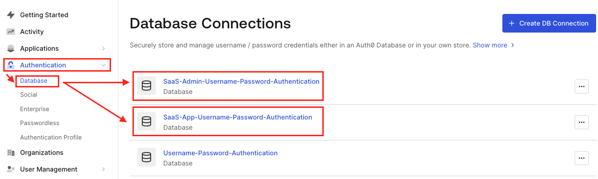Figure 1: Auth0 Database Connections</p>
<p align="center">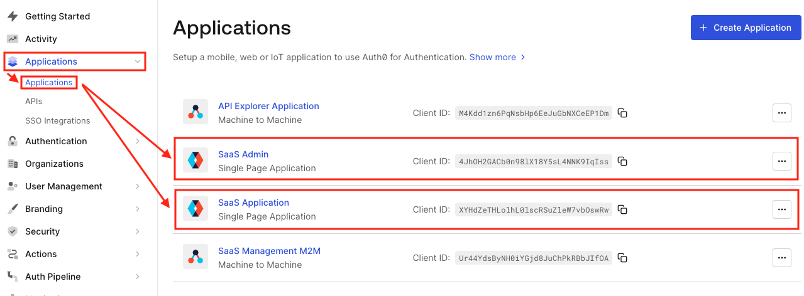Figure 2: Auth0 Applications</p>

The **SaaS Admin** Application allows the login only from the **SaaS-Admin-Username-Password-Authentication** Database. The **SaaS Application** Application allows the login only from the **SaaS-App-Username-Password-Authentication** Database. 
<p align="center">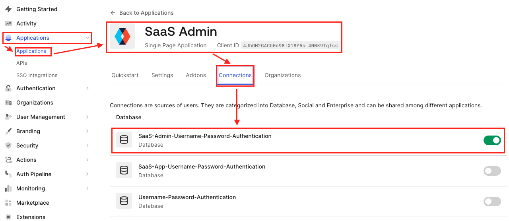Figure 3: SaaS Admin Application Connection</p>

To use Auth0 Organizations for the **SaaS Application**, the configuration for **Organizations** was set to **Business Users**.
<p align="center">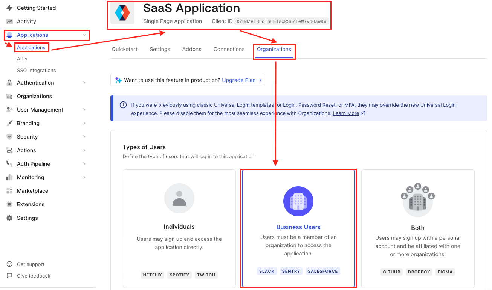Figure 4: SaaS Application Organization Business Users</p>

The Login flow for the **SaaS Application** can be configured in 3 different ways. By default it's **prompt for credentials**. The user starts to enter his email address.
<p align="center">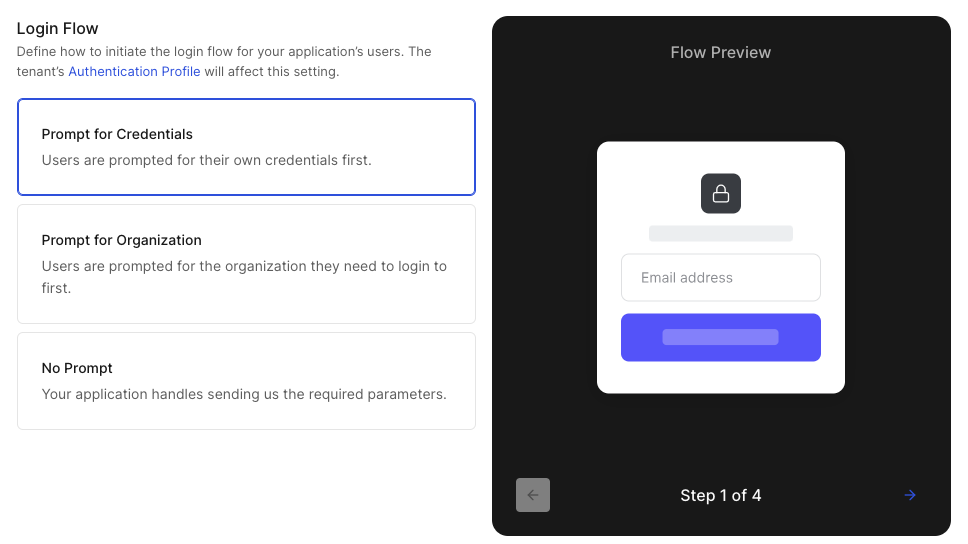Figure 5: Application Organization Prompt for credentials</p>

 What happens if the user belongs to multiple Organizations? Auth0 will provide an Organization Selector:
<p align="center">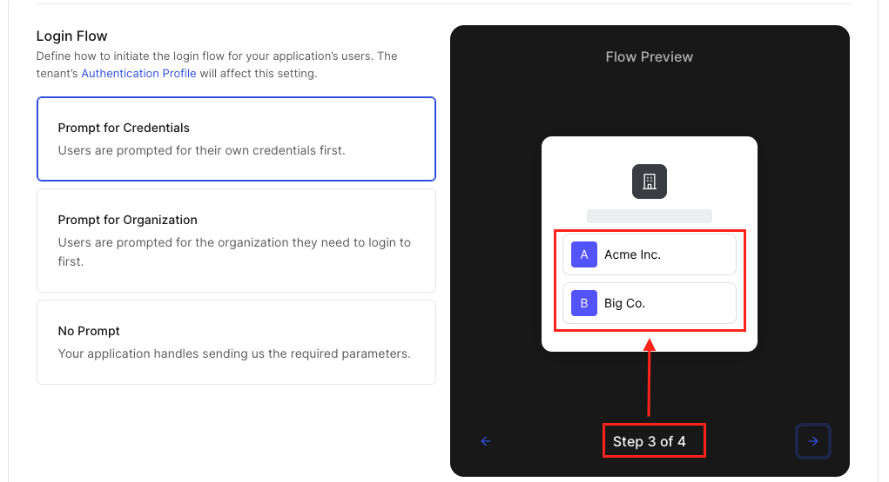Figure 6: Auth0 Organization Selector</p>

The other approach is how this sample app is implemented, you start by entering the tenant name, or with Auth0 it's the Organization Name:
<p align="center">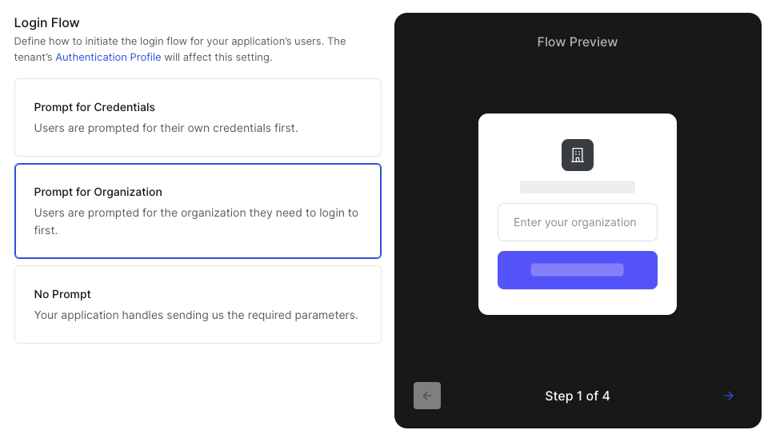Figure 7: Application Organization Prompt for Organization</p>

The deployment script also creates 2 Roles: **SystemAdmin** and **TenantAdmin**.
<p align="center">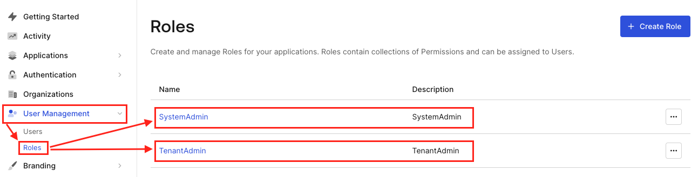Figure 8: Auth0 Roles</p>

The initial Admin User is created in the **SaaS-Admin-Username-Password-Authentication** Database and the Role **SystemAdmin** was assigned.
<p align="center">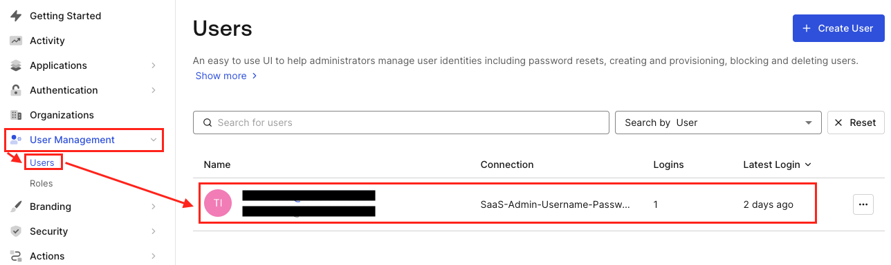Figure 9: Admin User</p>
<p align="center">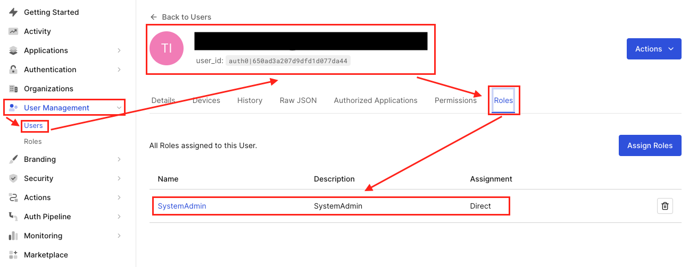Figure 10: SystemAdmin User Role is assigned to the User</p>

Auth0 provides multiple flows that can be customized and extended. As part of this sample application is the **Login** flow customized: 
<p align="center">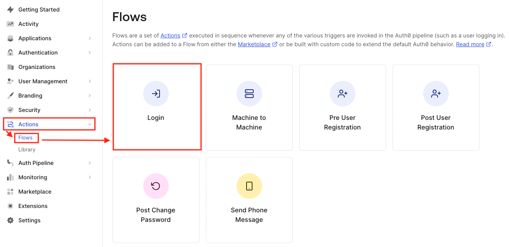Figure 11: Auth0 Flows</p>

The **Login** flow has a custom Auth0 Action called **Enrich SaaS Token**.
- Auth0 Actions are written in JavaScript and run during the Authentication request. They work similar to a Lambda Function, but they are hosted and run inside Auth0.
- The **Enrich SaaS Token** Action will provide additional claims on each login. We will take a closer look at them in the following labs.
<p align="center">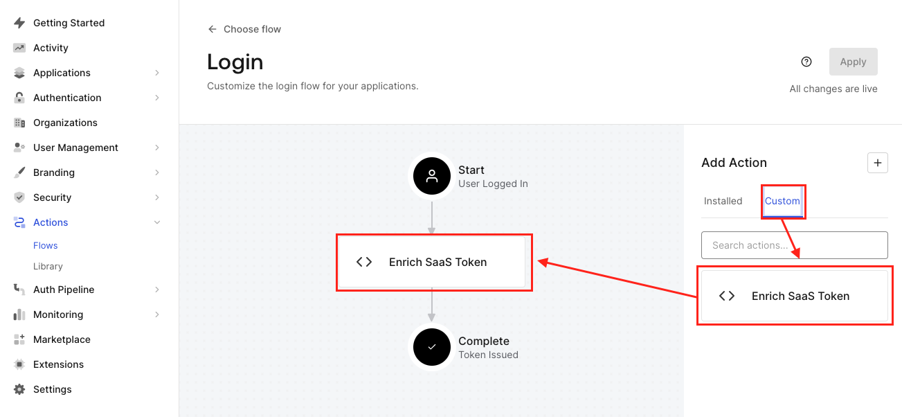Figure 12: Login Flow Enrich SaaS Token</p>

### 3. First Login with Admin Application with Auth0

TODO:

### 4. Create a new Tenant

TODO:

### 5. Login to new Tenant

TODO:

### 6. Additional Use Cases

TODO:

#### How Auth0 simplifies Authentication for the SaaS Sample Application

TODO: rewrite

- Organization
    - Start with Email or Domain Name
- Enterprise Connections (Okta, AzureAD, AD ...)

#### Build vs Buy - SaaS specific features you get with Auth0

TODO: rewrite

- Organization
    - Start with Email or Domain Name
- Enterprise Connections
- Migrate Existing Users
- SSO across multiple Applications
- MFA Factors
- Password less
- Attach Protection
- SCIM
- Syncing AD: https://auth0.com/docs/authenticate/identity-providers/enterprise-identity-providers/active-directory-ldap
- Auth0 Marketplace


#### Customize Login Flow with Auth0 ##

TODO: rewrite

- Authentication: Auth0 provides various authentication methods, including username/password, social login (such as Google, Facebook, Twitter), passwordless authentication, and multi-factor authentication (MFA). This allows you to offer your users different options for logging in and securing their accounts.
- Authorization and Access Control: Auth0 offers robust authorization features, such as role-based access control (RBAC), attribute-based access control (ABAC), and fine-grained permissions. You can define roles and permissions for different user types, control access to specific resources or APIs, and enforce authorization rules based on user attributes.
- Single Sign-On (SSO): With Auth0, you can implement SSO across multiple applications or services. This means that once a user is authenticated in one of your applications, they can seamlessly access other connected applications without having to re-enter their credentials, improving user experience and productivity.
- Social Identity Providers: Auth0 supports integration with popular social identity providers, enabling users to authenticate using their existing social media accounts. This eliminates the need for users to create new accounts and passwords, reducing friction during the onboarding process.
- Multi Factor Authentication (MFA): Auth0 provides support for various MFA methods, including SMS, email-based OTP, hardware tokens, and push notifications. Enabling MFA adds an extra layer of security by requiring users to provide an additional authentication factor during login.
- Customization and Branding: You can customize the look and feel of Auth0's login screens and UI elements to match your SaaS application's branding. This allows you to provide a consistent user experience and maintain your brand identity throughout the authentication process.
- Extensibility: Auth0 offers extensibility options through custom JavaScript rules and serverless functions (Auth0 Actions). This allows you to customize and extend Auth0's behavior to meet your specific requirements. You can enforce additional validation rules, enrich user profiles, integrate with external systems, and more.
- Security Features: Auth0 prioritizes security and provides features such as brute force protection, anomaly detection, IP blocking, and breached password detection. These features help protect user accounts and prevent unauthorized access.
- Compliance and Regulatory Support: Auth0 provides tools and features to help you meet various compliance requirements, such as GDPR, HIPAA, and SOC 2. It offers features like data privacy controls, consent management, audit logs, and the ability to store user data in specific regions.
- Developer Resources and Community: Auth0 offers extensive documentation, SDKs, and developer resources to assist SaaS builders. They provide libraries and quick-start guides for various programming languages and frameworks, as well as an active developer community where you can seek support and share knowledge.